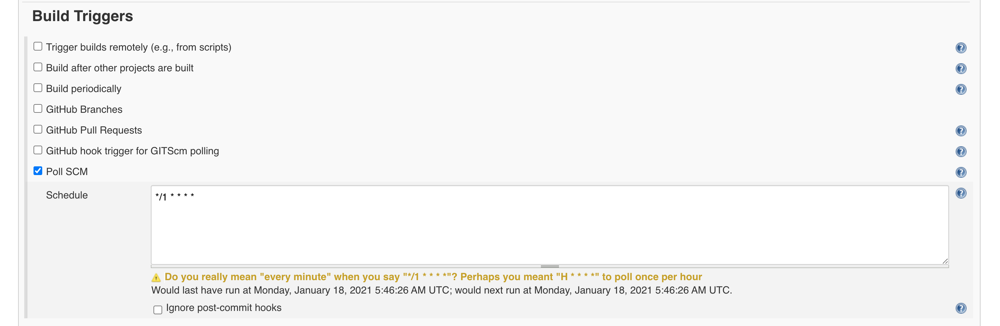

## upload-pgyer


这是一款上传apk/ipa文件到蒲公英并通知到指定群的工具（同时支持钉钉、飞书、企业微信）.

> 注：本项目依赖于`node.js`，使用前请先安装 `node.js` 环境 ，然后在项目根目录执行`npm install` 安装依赖.


### 使用示例
```js
node upload-pgyer.js --filepath='xxxx' --apikey='xxxx' --webhook='xxxx' --buildurl='https://www.baidu.com/' --platform='android' --target='lark'
```

### 所需参数
 name | description | value:string
 ---- | --- | ----
 platform |	构建的平台         |  ios / android
 filepath |	上传文件的绝对路径   |   string  
 apikey   |	蒲公英平台提供的API key	  |     string
 webhook  |	要发送平台提供的webhook	  |       string
 buildurl |本次构建的url地址 |  string
 target   |	发送消息的平台 | lark / dingtalk / wechat


注： 由于钉钉的 `webhook` 必须设置安全校验，这里默认关键词设置为`新的构建任务`.即是：如果你使用的是钉钉平台，那么添加机器人的时候必须设置`keyword`为`新的构建任务`.
 ### 预览
依次为飞书、钉钉、企业微信：

|   |  |
| :---------------------------------: | :---------------------------------: |
|   |  
|  |                             


### CI / CD 说明

本工具主要为了实现移动端持续集成功能，你可以将该工具配合其他工具使用，例如: `Jenkins`、`Travis` 等等.
#### android

下面介绍一下如何配合`Jenkins` + `蒲公英` + `飞书` 实现 `android` 端 `CI` 流程的使用.

> Jenkins的安装过程省略。建议使用 `homebrew` 安装.

首先，明确我们想要实现的目标：

`git commit`包含指定指令 -> `Jenkins` 收到更新 -> 远程目标机执行构建操作 -> 上传安装包至蒲公英 -> 目标平台发送通知.

新建一个`Item`，选择 `Freestyle Project`，点击进入`Item`,选择 `Configure` 进入配置页面.
这里我们选择的是`git`管理项目：


这里需要设置凭证, 需要设置自己的`git`的账户和密码然后作为`jenkins`的凭据，在填写项目`git`地址时，选择对应的凭证.

填写 `Build Triggers`



这里我们选择轮询的方式，`*/1 * * * *` 表明每隔一分钟去检查代码仓库的变化.

填写 `Build Environment`


这里我们需要安装一个`Jenkins` 插件:`Commit Message Trigger`,该款插件可以设置`commit Keyword`的方式触发构建操作.

接下来填写 `Build`


我们选择的是 `Execute shell` 的方式.可以看见，我们在这一步执行了 `build` 操作,`build` 完成生成 `apk`文件之后，我们就利用了这款脚本执行了上传`蒲公英` + `通知飞书`的操作.


配置完成点击保存.

然后在`dev`分支`commit` 时，包含设置的关键字：`[ci build-android-dev]`,`Jenkins` 检测到变更便会触发构建流程.


#### ios

由于 `ios` 构建安装包需要 `苹果开发者证书`,所以这里不作详细介绍.

ios 建议使用 [`fastlane`](https://github.com/fastlane/fastlane) 完成构建操作，然后结合该款工具实现`CI`流程.

这里给出一些参考文章：

[flutter 配合Jenkins, Fastlane自动化打包上传蒲公英](https://juejin.cn/post/6862942906576011272)

[fastlane使用说明书](https://juejin.cn/post/6844903880795684877)

[fastlane二三小事](https://juejin.cn/post/6844904114841714702)